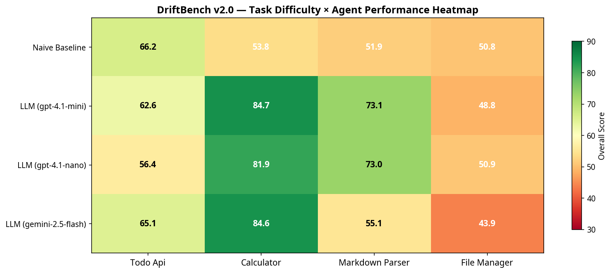
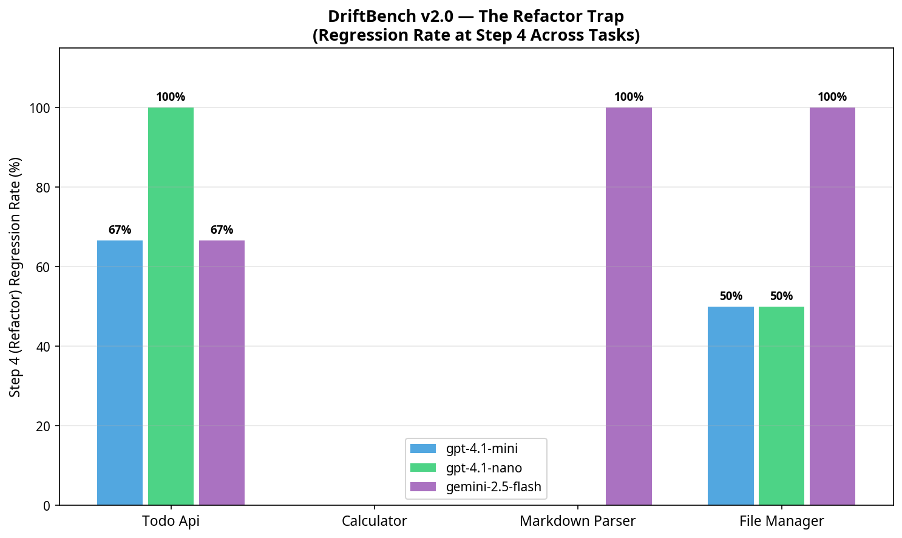
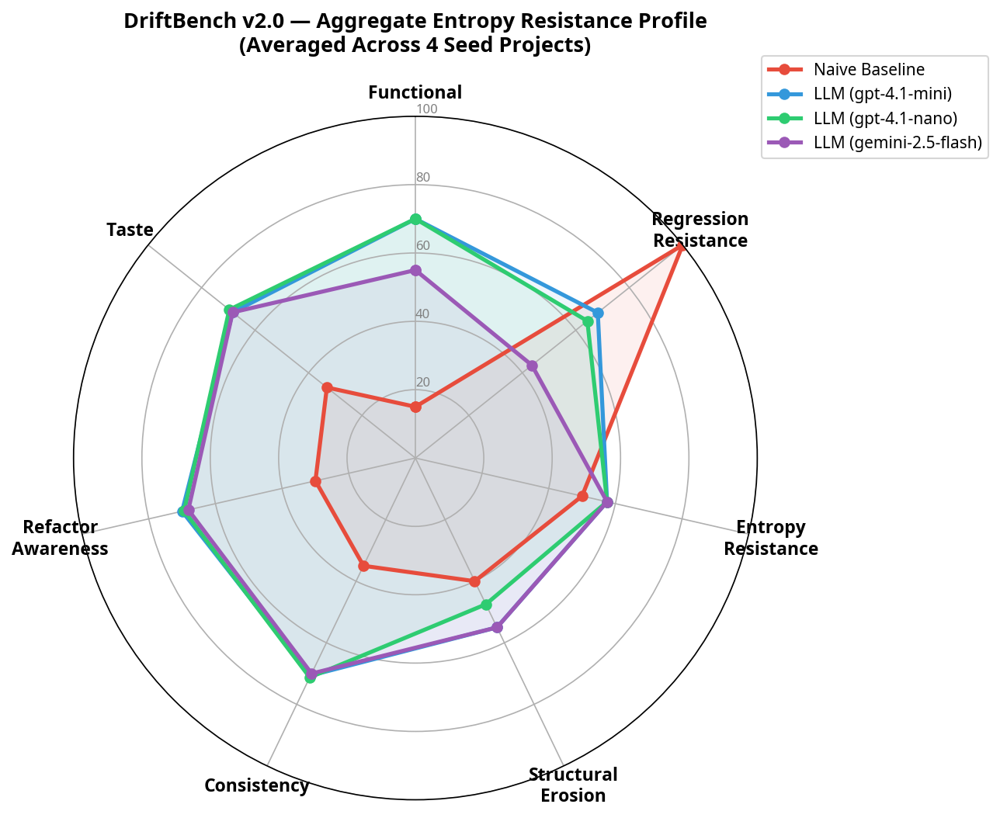
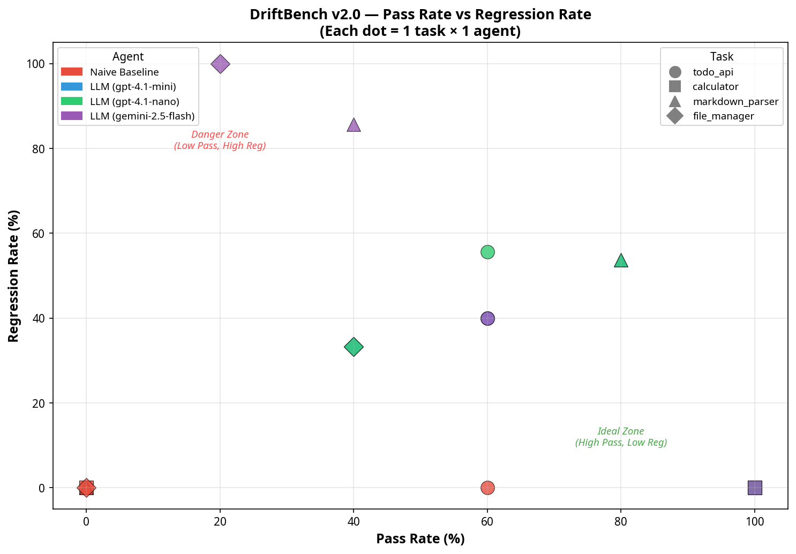

# DriftBench v2.0

**A Benchmark for Measuring Coding Agent Entropy Resistance Under Iterative Development**

[](https://opensource.org/licenses/MIT)
[](https://www.python.org/downloads/)

> DriftBench evaluates whether coding agents can maintain code quality, architectural coherence, and backward compatibility across a chain of iterative development tasks — not just solve isolated problems.



---

## What Makes DriftBench Different?

Existing coding benchmarks (SWE-bench, HumanEval, MBPP) test agents on **single-shot** tasks. Real software engineering is **iterative**: features pile up, bugs get fixed, code gets refactored. DriftBench measures what happens when an agent must evolve a codebase through a **5-step task chain** of increasing complexity:

```
Step 1: Feature Addition → Step 2: Bug Fix → Step 3: Feature Addition
→ Step 4: Refactor (the trap!) → Step 5: Evolution
```

### Core Insight: The Refactor Trap

Our experiments reveal that LLM agents suffer **67-100% regression rates** at Step 4 (refactoring), even when they pass all previous steps perfectly. This is the "entropy drift" that DriftBench is designed to measure.



---

## v2.0 Improvements Over v1.0

| Feature | v1.0 | v2.0 |
|---------|------|------|
| Seed Projects | 1 (todo_api) | **4** (todo_api, calculator, markdown_parser, file_manager) |
| Test Granularity | File-level | **Test-case-level** (pytest JSON parsing) |
| Entropy Tracking | Head-tail only | **Per-step CC + Structural Erosion trajectory** |
| Test Isolation | Tests visible to agent | **Tests hidden from agent sandbox** |
| LLM Judge | Single model | **Multi-model cross-validation** (Cohen's Kappa) |
| Models Tested | GPT-4.1-mini only | **gpt-4.1-mini, gpt-4.1-nano, gemini-2.5-flash** |
| Scoring Dimensions | 6 | **7** (added Structural Erosion) |
| Visualizations | 3 charts | **11 chart types** including heatmaps, scatter plots |

---

## Quick Start

```bash
# Install dependencies
pip install openai radon pytest matplotlib numpy

# Run with naive baseline only (no API key needed)
python run_benchmark.py --tasks todo_api --no-llm-agent --no-llm-judge

# Run full benchmark with LLM agents
export OPENAI_API_KEY="your-key"
python run_benchmark.py \
  --tasks todo_api calculator markdown_parser file_manager \
  --models gpt-4.1-mini gpt-4.1-nano gemini-2.5-flash

# Run specific task with specific model
python run_benchmark.py --tasks calculator --models gpt-4.1-mini
```

---

## Architecture

```
driftbench/
├── driftbench/
│   ├── harness.py      # Core evaluation harness (sandbox, test runner, CC tracker)
│   ├── agents.py       # Agent implementations (Naive Baseline + LLM agents)
│   ├── grader.py       # Multi-dimensional scoring + LLM-as-Judge
│   └── visualize.py    # Publication-quality chart generation
├── tasks/
│   ├── todo_api/       # Seed project 1: REST-like TODO manager
│   ├── calculator/     # Seed project 2: Calculator with history
│   ├── markdown_parser/# Seed project 3: Markdown-to-HTML converter
│   └── file_manager/   # Seed project 4: In-memory file system
├── results/            # Generated charts and JSON results
├── run_benchmark.py    # CLI entry point
└── generate_all_charts.py  # Cross-task visualization generator
```

---

## Scoring Dimensions (7 axes)

| Dimension | Weight | What It Measures |
|-----------|--------|------------------|
| Functional Correctness | 25% | Pass rate on new test cases per step |
| Regression Resistance | 25% | Ability to preserve previously passing tests |
| Entropy Resistance | 10% | Cyclomatic complexity growth control |
| Structural Erosion | 10% | Code structure degradation (function count, avg length) |
| Architectural Consistency | 10% | LLM Judge: naming, patterns, modularity |
| Refactor Awareness | 10% | LLM Judge: quality of structural changes |
| Engineering Taste | 10% | LLM Judge: idiomatic style, error handling |



---

## Experiment Results (v2.0)

### Cross-Task Summary

| Task | gpt-4.1-mini | gpt-4.1-nano | gemini-2.5-flash | Naive Baseline |
|------|-------------|-------------|------------------|----------------|
| todo_api | 62.6 | 56.4 | 65.1 | 66.2 |
| calculator | **84.7** | 81.9 | 84.6 | 53.8 |
| markdown_parser | **73.1** | 73.0 | 55.1 | 51.9 |
| file_manager | 48.8 | 50.9 | 43.9 | 50.8 |
| **Average** | **67.3** | **65.6** | **62.2** | **55.7** |

### Key Findings

1. **The Refactor Trap is real and reproducible**: Step 4 regression rates of 67-100% across 3 of 4 tasks for all LLM agents.

2. **Task difficulty matters**: Calculator (simple state) sees 100% pass rates; file_manager (complex path handling) drops to 20-40%.

3. **Regression is the differentiator**: All agents achieve similar pass rates, but regression resistance varies dramatically (0% to 100%).

4. **gemini-2.5-flash is most regression-prone**: 85.7% regression on markdown_parser, 100% on file_manager.



---

## Adding New Seed Projects

Create a new directory under `tasks/` with:

```
tasks/my_project/
├── app.py              # Initial seed code
├── task_chain.json     # 5-step task chain definition
├── test_step1_*.py     # Test file for step 1
├── test_step2_*.py     # Test file for step 2
├── test_step3_*.py     # Test file for step 3
├── test_step4_*.py     # Test file for step 4 (refactor!)
└── test_step5_*.py     # Test file for step 5
```

Then run: `python run_benchmark.py --tasks my_project`

---

## References

[1] MKWritesHere. "75% of AI Coding Agents Introduce Regressions During Long-Term Maintenance". Level Up Coding, Mar 2026.
[2] Thai et al. "SWE-EVO: Benchmarking Coding Agents in Long-Horizon Software Evolution Scenarios". arXiv:2512.18470, Dec 2025.
[3] Chen et al. "SWE-CI: Evaluating Agent Capabilities in Maintaining Codebases via Continuous Integration". arXiv:2603.03823, Mar 2026.
[4] Zhu et al. "Needle in the Repo: A Benchmark for Maintainability in AI-Generated Repository Edits". arXiv:2603.27745, Mar 2026.

---

## Citation

```
@misc{driftbench2025,
  title={DriftBench: Measuring Coding Agent Entropy Resistance Under Iterative Development},
  author={Randy},
  year={2025},
  url={https://github.com/Randy-sin/driftbench}
}
```

## License

MIT

---
*Created by Randy. Inspired by the challenges of building production-grade Agent Swarms.*
