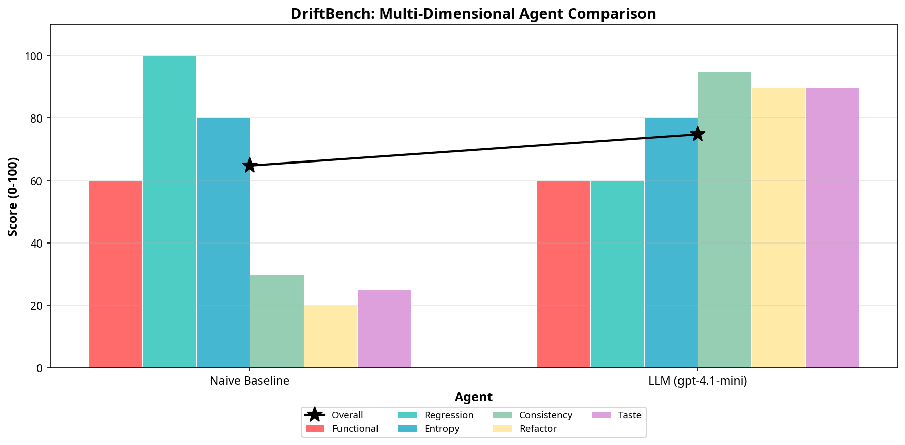
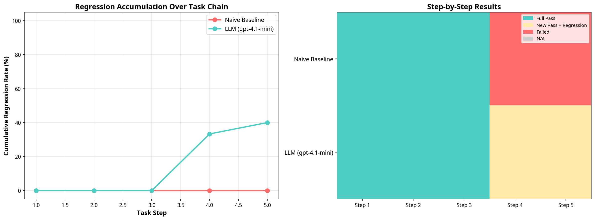
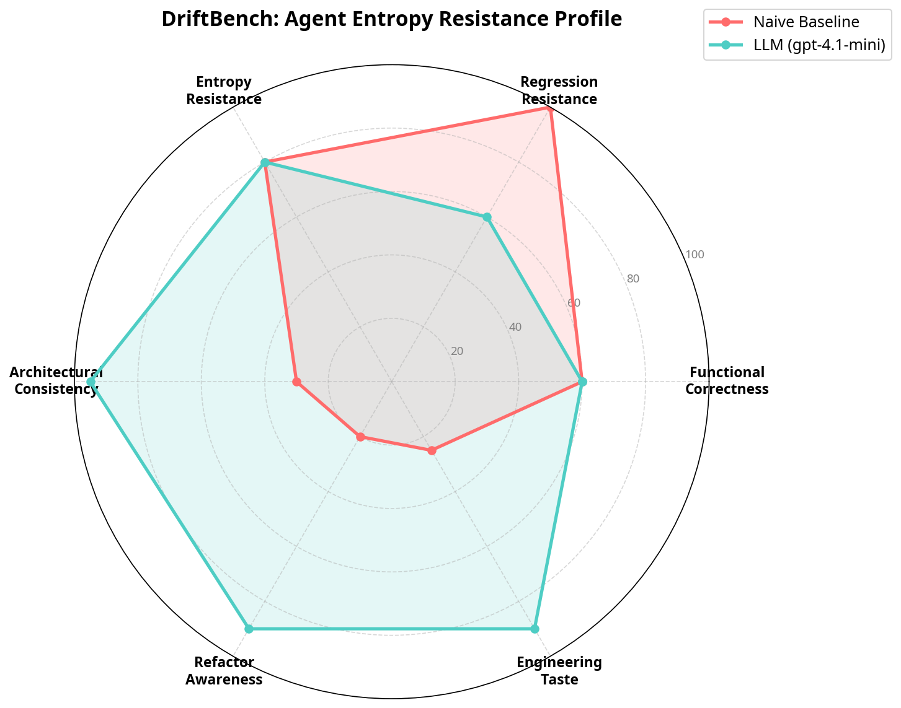

# DriftBench: Measuring Code Entropy Resistance in AI Agents

[](https://opensource.org/licenses/MIT)
[](https://www.python.org/downloads/)

DriftBench is a novel benchmark designed to evaluate an AI coding agent's **Entropy Resistance** during long-term software evolution. 

While existing benchmarks like SWE-bench measure an agent's ability to fix a single bug in a frozen snapshot, DriftBench evaluates agents on a **Task Chain**—a sequence of consecutive tasks (feature additions, bug fixes, and refactoring requests) on the *same* codebase. It measures not just functional correctness, but whether the codebase becomes more or less maintainable over time.



## The Motivation

In early 2026, the AI engineering community recognized a critical limitation in existing evaluations: 75% of AI coding agents introduce regressions during long-term maintenance [1]. 

If an agent simply appends `if/else` statements to pass the current test without refactoring, the codebase quickly becomes unmaintainable. We call this phenomenon **Code Entropy**. DriftBench was built to quantify this entropy and evaluate whether agents possess the "engineering taste" required for autonomous, long-horizon development.

## Core Evaluation Dimensions

DriftBench evaluates agents across six dimensions, combining deterministic static analysis with LLM-as-a-Judge evaluations:

1. **Functional Correctness**: Does the new code pass the new tests?
2. **Regression Resistance**: Does the new code break previously passing tests?
3. **Entropy Delta**: How much did the Cyclomatic Complexity (CC) and Code Duplication Rate change?
4. **Architectural Consistency** (LLM Judge): Does the code feel like it was written by one author?
5. **Refactor Awareness** (LLM Judge): Did the agent proactively manage technical debt?
6. **Engineering Taste** (LLM Judge): Are the variable names, error handling, and abstractions sensible?

## Demo Results

We ran a 5-step evolution task on a minimal TODO API using two agents:
1. **Naive Baseline**: An agent that simply appends code to the end of the file without modifying existing logic.
2. **LLM Agent (gpt-4.1-mini)**: A standard zero-shot LLM coding agent.

### The Refactoring Trap



As shown in the progression chart above, the LLM Agent successfully completed the first 3 feature/bugfix steps. However, at Step 4 (a major refactoring request), it successfully implemented the new structure but **broke 2 out of 3 previous tests** (a 66% regression rate for that step). 

The Naive Baseline had a 0% regression rate because it never touched existing code—but it scored terribly on the LLM-as-Judge metrics for Taste and Consistency.



The radar chart illustrates the trade-off: The LLM agent has great "Taste" and "Refactor Awareness", but struggles with "Regression Resistance" during complex refactoring.

## Installation & Usage

### Prerequisites
- Python 3.11+
- OpenAI API Key (for LLM-as-a-Judge and the LLM Agent)

### Setup
```bash
git clone https://github.com/Randyxian/driftbench.git
cd driftbench
pip install -r requirements.txt
```
*(Note: You can install the required packages manually: `pip install radon pytest openai matplotlib numpy`)*

### Running the Benchmark

To run the benchmark with the default Naive Baseline:
```bash
python run_benchmark.py
```

To run the benchmark with the LLM Agent (requires `OPENAI_API_KEY`):
```bash
export OPENAI_API_KEY="your-api-key-here"
python run_benchmark.py --with-llm --model gpt-4.1-mini
```

The results, including JSON reports and visualization charts, will be saved in the `results/` directory.

## Project Structure

- `driftbench/harness.py`: Core execution engine that isolates the sandbox and runs task chains.
- `driftbench/grader.py`: Evaluation logic combining static analysis (`radon`) and LLM judging.
- `driftbench/agents.py`: Implementations of the Naive Baseline and LLM Agent.
- `driftbench/visualize.py`: Matplotlib-based chart generation.
- `tasks/todo_api/`: The seed project and the 5-step task chain definitions.

## Contributing

DriftBench is currently a Proof-of-Concept (PoC). Contributions to expand the task chains, add support for more agent frameworks (e.g., OpenHands, AutoGPT), or refine the LLM-as-a-Judge prompts are highly welcome.

## References

[1] MKWritesHere. "75% of AI Coding Agents Introduce Regressions During Long-Term Maintenance". Level Up Coding, Mar 2026.
[2] Thai et al. "SWE-EVO: Benchmarking Coding Agents in Long-Horizon Software Evolution Scenarios". arXiv:2512.18470, Dec 2025.
[3] Chen et al. "SWE-CI: Evaluating Agent Capabilities in Maintaining Codebases via Continuous Integration". arXiv:2603.03823, Mar 2026.
[4] Zhu et al. "Needle in the Repo: A Benchmark for Maintainability in AI-Generated Repository Edits". arXiv:2603.27745, Mar 2026.

---
*Created by Randy Xian. Inspired by the challenges of building production-grade Agent Swarms.*
